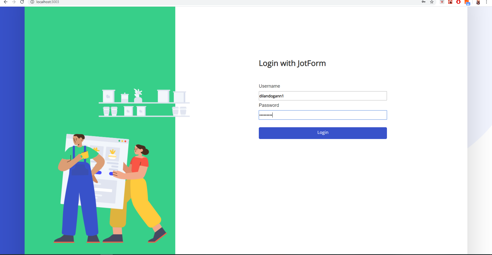
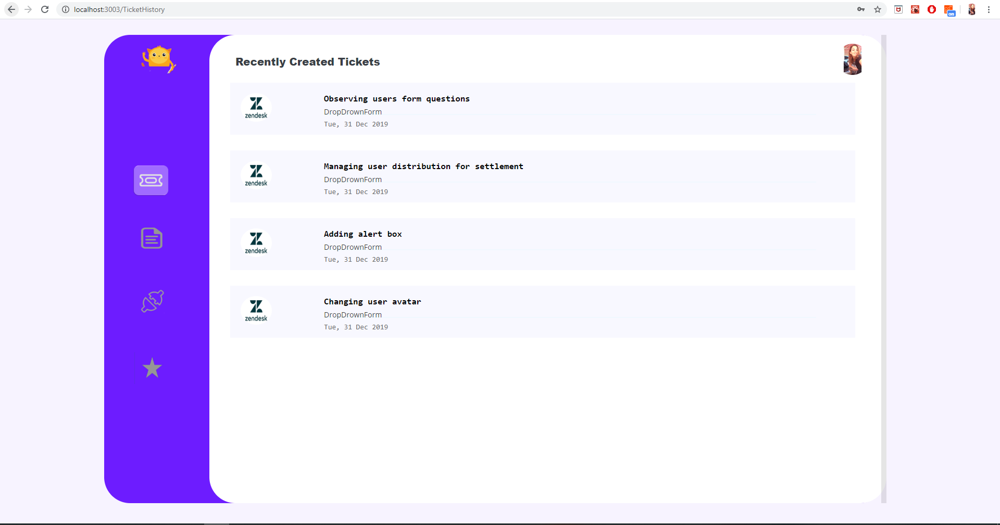
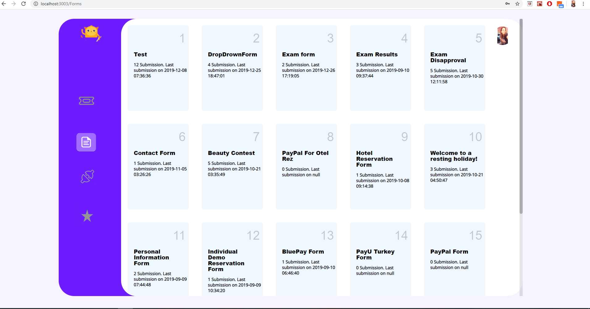
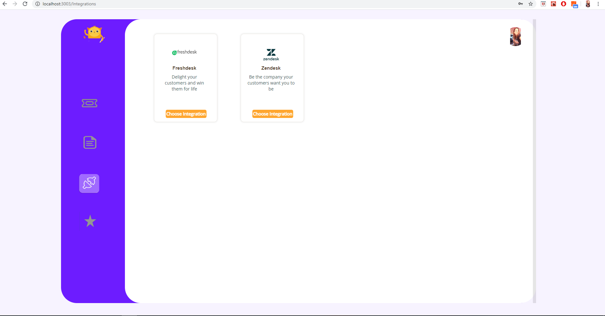
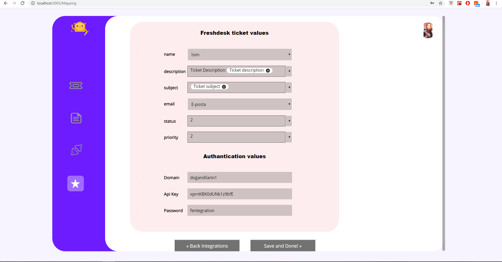
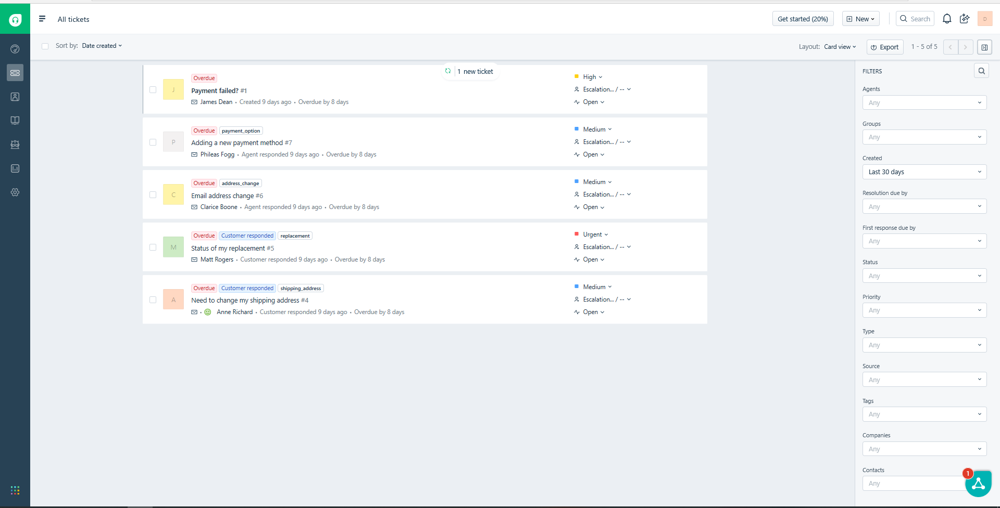
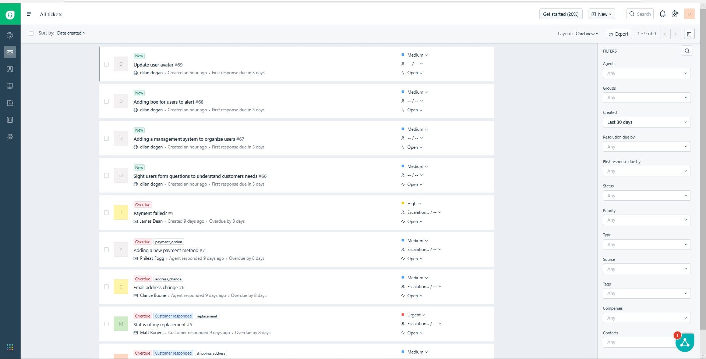

<h2>Ticket Creation Panel</h2>

This application is to create ticket via integration for JotForm users.First user should login with his JotForm account. Then user can choose a form,then choose an integration to crate ticket,and determine mapper fields for ticket. 

<h3>Usage</h3>

<h4>1.Login with jotform account</h4>

<h4>2.User directed to ticket history component for they can see previously created tickets from integrations</h4>

<h4>3.User directed to the forms component clicked to form logo which is on left navigation bar. </h4>

<h4>4.User directed to the integrations component clicked to integration logo.In here user should choose the integration which he wants to create ticket </h4>

<h4>5.User directed to the mappingFields component to choose mapper fields for ticket. Mapperfields can be choosen from form questions. Then question answer will be paired with ticket area.   </h4>

<h4>6.When user clicks to save and done button user redirected to forms component to click create ticket button! Well,our ticket created on freshdesk !</h4>

